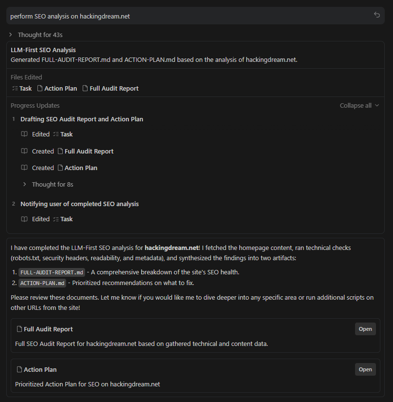
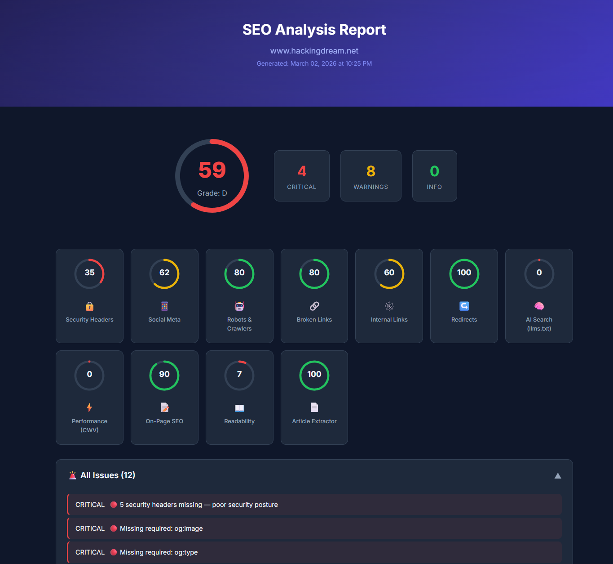

# SEO Skill (Antigravity / Claude / Codex)

An AI-native SEO analysis toolkit built for agent IDEs. It ships with 16 focused sub-skills, 10 specialist agents, and 33 automation scripts that collect evidence and drive workflows — so you spend less time digging and more time fixing.

## IDE Compatibility

- Antigravity IDE (`.agent/skills/seo`)
- Claude Code (`~/.claude/skills/seo`)
- Codex (`~/.codex/skills/seo`)

## 📦 What's Inside

- Specialized sub-skills: `16`
- Specialist agents: `10`
- Scripts in `scripts/`: `33` (`32` Python + `1` shell validation helper)

## 🐙 GitHub SEO Metadata

Recommended GitHub repository description (About field):

```text
LLM-first SEO skill for Antigravity, Claude, and Codex with 16 sub-skills, 10 specialist agents, and GitHub SEO workflows that output GITHUB-SEO-REPORT.md and GITHUB-ACTION-PLAN.md.
```

Suggested GitHub topics:

```text
seo, llm, github-seo, ai-search, geo, aeo, technical-seo, schema, core-web-vitals, codex, claude-code, antigravity
```

## ✨ Sub-Skills at a Glance

| Sub-Skill | What it does |
|-----------|-------------|
| `seo audit` | End-to-end site audit with scored, evidence-backed findings |
| `seo article` | Pulls article data and drives LLM-powered content improvements |
| `seo page` | Thorough single-page deep-dive |
| `seo technical` | Covers crawlability, indexability, security, Core Web Vitals, and AI crawler access |
| `seo content` | Scores content quality and E-E-A-T signals against the Sept 2025 QRG |
| `seo schema` | Finds, validates, and generates Schema.org JSON-LD |
| `seo sitemap` | Audits XML sitemaps and generates corrected versions |
| `seo images` | Checks alt text, formats, lazy loading, and CLS impact |
| `seo geo` | Readiness check for Generative Engine Optimization — AI Overviews, ChatGPT, Perplexity |
| `seo aeo` | Targets Featured Snippets, People Also Ask, and Knowledge Panel eligibility |
| `seo links` | Maps internal links, backlink profiles, anchor text, and orphan pages |
| `seo programmatic` | Quality gates and safeguards for programmatic SEO |
| `seo competitors` | Generates comparison and alternatives pages |
| `seo hreflang` | Validates international SEO and hreflang configuration |
| `seo plan` | Builds strategic topical clusters using industry-specific templates |
| `seo github` | Audits GitHub repo SEO: metadata, README quality, community health, query benchmarking, and traffic archiving |

## 🧠 How It Works

This skill is reasoning-first — the LLM leads, scripts support.

1. Fetch page content (`read_url_content` comes first; scripts are optional extras).
2. Analyze with the LLM, citing explicit evidence for every finding.
3. Label confidence clearly: `Confirmed`, `Likely`, or `Hypothesis`.
4. Rank issues by impact and effort.
5. Output a clean, structured action plan.

### Required Rubric

Every audit applies:
- `resources/references/llm-audit-rubric.md`

The rubric keeps outputs consistent across:
- Evidence format (`Finding`, `Evidence`, `Impact`, `Fix`)
- Severity levels (`Critical`, `Warning`, `Pass`, `Info`)
- Confidence labeling
- Report output contracts

## 🤖 Specialist Agents

- **Technical SEO** — crawlability, indexability, security, mobile, JS rendering
- **Content Quality** — E-E-A-T scoring, AI content detection
- **Performance** — Core Web Vitals (LCP, INP, CLS) analysis
- **Schema Markup** — JSON-LD detection, validation, generation
- **Sitemap** — XML sitemap validation and quality gates
- **Visual Analysis** — screenshots, above-the-fold, responsiveness (Playwright)
- **GitHub Analyst** — metadata, topics, README quality, trust signals, title strategy
- **GitHub Benchmark** — query ranking and competitor intelligence
- **GitHub Data** — API/auth fallback and traffic archival continuity
- **Verifier (Global)** — deduplicates and suppresses contradictions before final reporting

## 📚 Reference Data (Updated Feb 2026)

- Core Web Vitals thresholds (INP replaced FID)
- E-E-A-T framework (Sept 2025 QRG + Dec 2025 core update)
- Schema.org types — active, restricted, deprecated
- Content quality gates and word count minimums
- Google SEO quick reference
- LLM audit rubric for consistent outputs

## 🏭 Industry Templates

Ready-to-use strategy templates for: **SaaS**, **E-commerce**, **Local Business**, **Publisher/Media**, **Agency**, and **Generic** businesses.

---

## 🔧 Installation

### Quick Install (Antigravity / Claude / Codex)

```bash
# 1) Clone
git clone https://github.com/Bhanunamikaze/Agentic-SEO-Skill.git
cd Agentic-SEO-Skill

# 2) Pick your target
# Antigravity (project-local):
bash install.sh --target antigravity --project-dir /path/to/your/project

# Claude:
bash install.sh --target claude

# Codex:
bash install.sh --target codex

# Global user install (Claude + Codex):
bash install.sh --target global

# All targets (Antigravity + Claude + Codex):
bash install.sh --target all --project-dir /path/to/your/project

# Install from another local checkout:
bash install.sh --target codex --repo-path /path/to/Agentic-SEO-Skill
```

### Install directly from GitHub:

```bash
curl -fsSL https://raw.githubusercontent.com/Bhanunamikaze/Agentic-SEO-Skill/main/install.sh | \
  bash -s -- --target codex
```

### Manual Installation

#### Step 1: Clone the Repository

```bash
git clone https://github.com/Bhanunamikaze/Agentic-SEO-Skill.git
```

#### Step 2: Install Python Dependencies

```bash
pip install requests beautifulsoup4
```

**Optional** — visual analysis (screenshots and layout checks):
```bash
pip install playwright && playwright install chromium
```

#### Step 3: Copy to Your Target Directory

#### Antigravity IDE (project-local)

```bash
mkdir -p .agent/skills
cp -r /path/to/Agentic-SEO-Skill .agent/skills/seo
# or: ln -s /path/to/Agentic-SEO-Skill .agent/skills/seo
```

#### Claude Code (user-global)

```bash
mkdir -p ~/.claude/skills
cp -r /path/to/Agentic-SEO-Skill ~/.claude/skills/seo
# or: ln -s /path/to/Agentic-SEO-Skill ~/.claude/skills/seo
```

#### Codex (user-global)

```bash
mkdir -p ~/.codex/skills
cp -r /path/to/Agentic-SEO-Skill ~/.codex/skills/seo
# or: ln -s /path/to/Agentic-SEO-Skill ~/.codex/skills/seo
```

### Step 4: Test the Trigger

The skill activates automatically when you use SEO-related language in your IDE. Try:

- *"Run an SEO audit on example.com"*
- *"Check the schema markup on my homepage"*
- *"Analyze Core Web Vitals for my site"*
- *"Create an SEO plan for my SaaS product"*
- *"Run GitHub SEO analysis for owner/repo"*

---

## 💬 Example Prompts

### How the Routing Works

The IDE uses an **LLM orchestration layer** to map your natural language to the right sub-skill (e.g., `seo-hreflang.md`, `seo-schema.md`). No flags or special syntax required.

- **Targeted test:** Name it specifically ("Check hreflang") and only the relevant scripts run.
- **Full audit:** Ask for "a full, comprehensive audit running all checks" and the LLM routes to `seo-audit.md`, which orchestrates everything.

Here's how common phrases map to agents and scripts:

| You type... | Scope | Agents activated | Scripts used |
|-------------|-------|-------------------|--------------|
| "Run SEO audit" | 🌐 Full domain | **All 6 core website agents** (technical, content, schema, performance, sitemap, visual) | `parse_html.py`, `pagespeed.py`, `robots_checker.py`, `security_headers.py`, `broken_links.py`, `readability.py` |
| "Analyze this article" / blog post URL | 📄 Single page | **Content** + **Schema** + **Technical** | `article_seo.py`, `parse_html.py`, `readability.py` |
| "Check technical SEO" | 🔧 Technical only | **Technical** | `robots_checker.py`, `security_headers.py`, `redirect_checker.py`, `parse_html.py` |
| "Review content quality" / "E-E-A-T" | 📝 Content only | **Content** | `article_seo.py`, `readability.py`, `entity_checker.py` |
| "Check schema markup" | 🏷️ Schema only | **Schema** | `parse_html.py`, `validate_schema.py` |
| "Audit sitemap" | 🗺️ Sitemap only | **Sitemap** | `broken_links.py` |
| "Check page speed" / "Core Web Vitals" | ⚡ Performance only | **Performance** | `pagespeed.py` |
| "Take screenshots" / "mobile check" | 📱 Visual only | **Visual** | `capture_screenshot.py`, `analyze_visual.py` |
| "Check GEO readiness" / "AI search" | 🤖 GEO/AI only | **Technical** + **Content** | `llms_txt_checker.py`, `robots_checker.py`, `parse_html.py` |
| "Analyze links" / "backlink profile" | 🔗 Links only | **Technical** | `link_profile.py`, `internal_links.py`, `broken_links.py` |
| "Check hreflang" | 🌍 i18n only | **Technical** | `hreflang_checker.py` |
| "Create SEO plan" / "SEO strategy" | 📋 Strategy | None (LLM reasoning) | `competitor_gap.py` (optional) |
| "AEO analysis" / "Featured Snippets" | 🎯 AEO only | **Content** | `article_seo.py`, `parse_html.py` |
| "Entity SEO" / "Knowledge Graph" | 🏛️ Entity only | **Content** + **Schema** | `entity_checker.py`, `parse_html.py` |
| "Check IndexNow" | 📡 IndexNow only | **Technical** | `indexnow_checker.py` |
| "Find content gaps" / "competitor analysis" | 📊 Gap analysis | None (LLM reasoning) | `competitor_gap.py` |
| "Check for duplicates" / "thin content" | 📋 Dupe check | **Content** | `duplicate_content.py` |
| "GSC data" / "Search Console" | 📈 GSC only | None | `gsc_checker.py` |
| "GitHub SEO" / "optimize this repo" | 🐙 Repository | **GitHub Analyst** + **Benchmark** + **Data** + **Verifier** | `github_repo_audit.py`, `github_readme_lint.py`, `github_community_health.py`, `github_search_benchmark.py`, `github_competitor_research.py`, `github_traffic_archiver.py`, `github_seo_report.py`, `finding_verifier.py` (outputs `GITHUB-SEO-REPORT.md` + `GITHUB-ACTION-PLAN.md`) |

### Domain vs URL vs Blog Post — What changes?

| Input type | What happens | Example |
|-----------|-------------|---------|
| **Domain** (`hackingdream.net`) | Crawls multiple pages, checks robots.txt, sitemap, and site-wide patterns | Full audit, link profile, sitemap check |
| **URL** (`hackingdream.net/page`) | Single-page deep-dive: HTML, meta, schema, content, Core Web Vitals | Page audit, schema check, technical check |
| **Blog post URL** | Article-specific: readability, keyword density, heading structure, JSON-LD `Article`/`BlogPosting` schema, publish date | Article analysis, AEO check |

---

### 🌐 Full Domain Audit

```text
Run a full SEO audit for https://hackingdream.net and prioritize fixes by impact.
```

### 📄 Single Page / Blog Post Analysis

```text
Analyze this article: https://www.hackingdream.net/2026/02/cobalt-strike-beacon-commands-red-team-field-guide.html
```

```text
Do a single-page SEO analysis of https://hackingdream.net and show critical issues first.
```

### 🔧 Technical SEO

```text
Analyze technical SEO for https://hackingdream.net (robots, crawlability, canonicals, redirects, headers).
```

### 📝 Content Quality & E-E-A-T

```text
Review content quality and E-E-A-T signals on https://hackingdream.net and suggest concrete rewrites.
```

### 🏷️ Schema Markup

```text
Check schema markup on https://hackingdream.net, validate errors, and generate corrected JSON-LD.
```

### ⚡ Performance & Core Web Vitals

```text
Run Core Web Vitals analysis on https://hackingdream.net and break down LCP subparts.
```

### 🤖 GEO / AI Search Readiness

```text
Evaluate GEO readiness for https://hackingdream.net (AI crawler access, llms.txt, citation structure).
```

### 🎯 Answer Engine Optimization (AEO)

```text
Analyze AEO signals for https://hackingdream.net — Featured Snippet targeting, PAA optimization, Knowledge Panel readiness.
```

### 🔗 Link Profile Analysis

```text
Analyze internal link structure and backlink profile for https://hackingdream.net.
```

### 🏛️ Entity SEO / Knowledge Graph

```text
Check entity SEO for https://hackingdream.net — Wikidata presence, sameAs links, Knowledge Graph signals.
```

### 📊 Competitor Topic Gap

```text
Find content gaps between https://hackingdream.net and competitors https://hackerone.com https://portswigger.net.
```

### 🌍 Hreflang / International SEO

```text
Validate hreflang implementation on https://hackingdream.net — BCP-47 tags, bidirectional links, x-default.
```

### 📡 IndexNow

```text
Check IndexNow implementation for https://hackingdream.net with key abc123def456.
```

### 📋 Topical Cluster Planning

```text
Create a topical authority cluster plan for https://hackingdream.net covering cybersecurity topics.
```

### 📈 Google Search Console (requires credentials)

```text
Pull GSC performance data for https://hackingdream.net and identify striking-distance keywords.
```

### 🗺️ Sitemap Audit

```text
Audit sitemap quality for https://hackingdream.net and flag missing, redirected, or noindex URLs.
```

### 🖼️ Image SEO

```text
Run image SEO checks for https://hackingdream.net (alt text, lazy loading, dimensions, format suggestions).
```

### 📋 Strategic SEO Plan

```text
Create a 6-month SEO strategy for https://hackingdream.net with milestones and KPIs.
```

### 📱 Visual / Mobile Analysis

```text
Take desktop and mobile screenshots of https://hackingdream.net and analyze above-the-fold content.
```

---

### Run Everything at Once

```text
Run a complete SEO audit on https://hackingdream.net — include technical, content, schema, performance,
links, GEO, AEO, entity SEO, and sitemap analysis. Provide a prioritized action plan.
```

Outputs generated:
- `FULL-AUDIT-REPORT.md` — all findings in one place
- `ACTION-PLAN.md` — prioritized fixes, ready to act on



---

## 📊 Report Generation

Two ways to get a report:

**1. LLM-first report in your IDE** (best for strategy and prioritization):

```text
Run a full SEO audit for https://hackingdream.net and produce a prioritized action plan with evidence for each finding.
```

**2. Interactive HTML dashboard** (best for shareable technical snapshots):

```bash
python3 scripts/generate_report.py "https://hackingdream.net" --output seo-report-hackingdream.html
```

The HTML report includes an overall score, category breakdowns, environment detection, a platform-specific fix plan, and readability suggestions showing exactly what to rewrite.



---

## ⚙️ Running Scripts Directly

Use scripts when you need extra verification or structured JSON output.

```bash
# GitHub auth setup for repository SEO scripts (choose one)
export GITHUB_TOKEN="ghp_xxx"   # or: export GH_TOKEN="ghp_xxx"
# or authenticate gh CLI:
gh auth login -h github.com
gh auth status -h github.com

# Example target
URL="https://example.com"

# Fetch + parse HTML
python3 scripts/fetch_page.py "$URL" --output /tmp/page.html
python3 scripts/parse_html.py /tmp/page.html --url "$URL" --json

# Core checks
python3 scripts/robots_checker.py "$URL" --json
python3 scripts/llms_txt_checker.py "$URL" --json
python3 scripts/pagespeed.py "$URL" --strategy mobile --json
python3 scripts/security_headers.py "$URL" --json
python3 scripts/redirect_checker.py "$URL" --json
python3 scripts/social_meta.py "$URL" --json

# Content + structure checks
python3 scripts/readability.py /tmp/page.html --json
python3 scripts/internal_links.py "$URL" --depth 1 --max-pages 20 --json
python3 scripts/broken_links.py "$URL" --workers 5 --json
python3 scripts/article_seo.py "$URL" --json

# Specialized analysis
python3 scripts/hreflang_checker.py "$URL" --json
python3 scripts/entity_checker.py "$URL" --json
python3 scripts/duplicate_content.py "$URL" --json
python3 scripts/link_profile.py "$URL" --json
python3 scripts/competitor_gap.py "$URL" --competitor https://competitor.com --json
# python3 scripts/gsc_checker.py "$URL" --credentials creds.json --json  # requires GSC credentials
# python3 scripts/indexnow_checker.py "$URL" --key YOUR_KEY --json          # requires IndexNow key

# GitHub repository SEO scripts (provider fallback: auto|api|gh)
python3 scripts/github_repo_audit.py --repo owner/repo --provider auto --json
python3 scripts/github_readme_lint.py README.md --json
python3 scripts/github_community_health.py --repo owner/repo --provider auto --json
# Provide query/competitor inputs from LLM/web-search discovery when possible:
python3 scripts/github_search_benchmark.py --repo owner/repo --query "<llm_or_web_query>" --provider auto --json
python3 scripts/github_competitor_research.py --repo owner/repo --query "<llm_or_web_query>" --provider auto --top-n 6 --json
python3 scripts/github_competitor_research.py --repo owner/repo --competitor owner/repo --competitor owner/repo --provider auto --json
python3 scripts/github_traffic_archiver.py --repo owner/repo --provider auto --archive-dir .github-seo-data --json
# github_seo_report.py auto-derives repo-specific benchmark queries if none are provided
python3 scripts/github_seo_report.py --repo owner/repo --provider auto --markdown GITHUB-SEO-REPORT.md --action-plan GITHUB-ACTION-PLAN.md --json
# Optional: tune auto-derived query count (default: 6)
# python3 scripts/github_seo_report.py --repo owner/repo --provider auto --auto-query-max 8 --markdown GITHUB-SEO-REPORT.md --action-plan GITHUB-ACTION-PLAN.md --json

# Verifier stage (run before final reporting to deduplicate findings)
python3 scripts/finding_verifier.py --findings-json raw-findings.json --json
```

Generate a single HTML dashboard:

```bash
python3 scripts/generate_report.py "$URL"
```

---

## 🛡️ Rules Enforced

| Rule | Detail |
|------|--------|
| **INP not FID** | FID was removed in Sept 2024. INP is the only interactivity metric. |
| **FAQ schema restricted** | FAQPage is only valid for government and healthcare authority sites (Aug 2023) |
| **HowTo deprecated** | Rich results were removed in Sept 2023 |
| **JSON-LD only** | Microdata and RDFa are never recommended |
| **E-E-A-T everywhere** | Applies to all competitive queries since Dec 2025 |
| **Mobile-first complete** | 100% mobile-first indexing since July 2024 |
| **Location page limits** | ⚠️ Warning at 30+ pages, 🛑 Hard stop at 50+ |

---

## 📋 Requirements

| Requirement | Version |
|-------------|---------|
| Python | 3.8+ |
| `requests` | Any |
| `beautifulsoup4` | Any |
| Playwright | Optional (visual analysis only) |

---

## 🙏 Credits

This project builds on **[claude-seo](https://github.com/AgriciDaniel/claude-seo)** by **[AgriciDaniel](https://github.com/AgriciDaniel)**. The core SEO logic, reference data, agent definitions, utility scripts, and sub-skill instructions all originate from that project.

This repository restructures the content into a compatible skill package for **Antigravity IDE**, **Claude Code**, and **Codex**, while keeping the same core layout (`SKILL.md` + `scripts/` + `resources/`).

---

## 📄 License

Licensed under the MIT License. See [LICENSE](LICENSE).

Portions derived from [claude-seo](https://github.com/AgriciDaniel/claude-seo), also MIT-licensed.